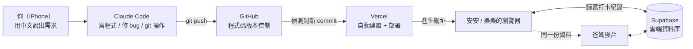

# 用一個真實專案，搞懂 Claude Code、GitHub、Vercel、Supabase

這份手冊以「安安樂樂每日任務打卡」這個真實專案為例，記錄我們這次從無到有、邊做邊踩坑的完整過程 ——
包含實際發生過的問題與排查方式。之後在 iPhone 上用 Claude Code 開發任何東西，都可以回來對照這份指南。

- repo: [tzshiang/Rachel-Amber-Daily-Tasks](https://github.com/tzshiang/Rachel-Amber-Daily-Tasks)
- 開發分支: `claude/daily-checklist-app-twins-wvz6h4`
- 原始 PR: [#1](https://github.com/tzshiang/Rachel-Amber-Daily-Tasks/pull/1)（已合併進 `main`）

另見：[開發 SOP：從需求到雲端資料庫](./dev-sop.md) —— 從這次經驗濃縮出的可重複使用流程。

## 1 · 大架構：四個角色怎麼合作

這四個工具各自負責一件事，串起來就是「你動口、我動手、程式自動上線、資料自動保存」的完整鏈路：

重點是：**程式碼**（App 長什麼樣子、怎麼運作）住在 GitHub，**執行後的網站**住在 Vercel，**資料**（誰哪天打了什麼勾）住在 Supabase。
三者是分開的系統，各自獨立運作、各自可能出錯，這也是後面「改了卻沒生效」最常見的原因 —— 通常是三者之一還沒跟上。

## 2 · 四個角色白話介紹

### Claude Code — 對話介面

你在 iPhone 上打字描述需求，Claude Code 在雲端的一台電腦裡實際寫程式、跑指令、操作 git，跟真的工程師在打字機前工作一樣，只是你用聊天取代打字。

> **這次做了：** 從零生出整個 React 專案、修 bug、串 Supabase、改圖示，每一步都對應一次 commit。

### GitHub — 程式碼倉庫

存放程式碼、記錄每一次修改的歷史（commit），也是 Vercel 和 Claude Code 之間交換程式碼的中繼站。

> **這次做了：** 建立 `claude/daily-checklist-app-twins-wvz6h4` 分支、開 PR #1、每次修改都 push 上去。

### Vercel — 網站主機

接上 GitHub 後，每次程式碼更新就自動重新「蓋房子」（build）並換上新的網站內容，你不用自己管伺服器。

> **這次做了：** 把 App 變成 `rachel-amber-daily-tasks.vercel.app` 這個安安樂樂能打開的網址。

### Supabase — 雲端資料庫

一個現成的雲端 Postgres 資料庫，網頁可以直接讀寫，不用自己架後端伺服器。

> **這次做了：** 建立 `task_completions`、`app_settings` 兩張表，存打卡紀錄和家長密碼。

## 3 · 這個專案實際發生了什麼事

下面照時間順序，記錄我們這次真的遇到的狀況與怎麼解決 —— 這些坑比任何教學文都更值得記住，因為都是親身經歷過的。

### Step 1 — 從一句需求生出整個 App

你描述了每日任務、雙胞胎各自的顏色喜好、愛心獎勵這些需求，Claude Code 直接搭出 React + Vite 專案、寫好首頁 / 打卡頁 / 家長後台三個畫面。

### Step 2（意外狀況）— GitHub repo 是全新空的，PR 開不起來

要開 PR 需要有一個「目標分支」可以合併進去，但這個 repo 連 `main` 都還不存在。解法是先建一個空的 `main` 分支，再把功能分支的歷史接上去，PR #1 才開得成。

> **學到：** 全新的 repo 一定要先有一個 default branch，之後的分支才有地方可以合併回去。

### Step 3 — 部署到 Vercel，拿到第一個網址

把 GitHub repo 接上 Vercel，第一次建置成功，拿到 `rachel-amber-daily-tasks.vercel.app`。

### Step 4（意外狀況）— 點任務打勾沒反應

實機測試時，單點一個任務畫面沒反應，但「離開再進去」就看得到打勾。根因是程式裡有段狀態讀取邏輯沒有正確訂閱資料變化，畫面因此不會重新渲染 —— 不是手機或觸控的問題。

> **學到：** 「操作後沒反應、重新整理才看得到」是很典型的「畫面沒重新渲染」症狀，不一定是網路或裝置問題。

### Step 5（意外狀況）— 修好了但正式網址一直沒更新

GitHub 顯示 Vercel 部署成功，但 `rachel-amber-daily-tasks.vercel.app` 卻沒變。原因是這個分支不是 Vercel 設定的「Production Branch」，每次 push 只會產生一個新的 Preview 網址，正式網址要手動「Promote to Production」才會更新。

> **學到：** Vercel 的「Production 網址」只跟著指定的分支自動更新，其他分支永遠只會產生 Preview 網址。

### Step 6 — 接上 Supabase 雲端資料庫

原本打卡資料只存在瀏覽器的 localStorage，換裝置就看不到。改成連接 Supabase 後，建了兩張表、設定安全規則（RLS），資料改成雲端讀寫，任何裝置打開都是同一份。

> **學到：** 環境變數（`VITE_SUPABASE_URL` 等）改了以後，Vercel 要重新建置一次才會生效，不會自動套用到舊的建置結果。

### Step 7 — 安安 🐱、樂樂 🐰，圖示微調

把安安的吉祥物換成貓咪、樂樂換成兔子 —— 這類小改動走的是同一條路徑：改程式 → commit → push → Vercel 自動重新建置。

### Step 8 — 合併 PR，解開 Production Branch 的根本問題

把 PR #1 合併進 `main` 後，Vercel 自動觸發了新的正式部署，不需要再手動 Promote —— 證實了 Production Branch 本來就設成 `main`，
問題只是 `main` 先前一直是空的。合併之後，往後 push 到 `main` 都會全自動更新正式網址。

## 4 · 一定要搞懂的關鍵觀念

### Production 網址 vs. Preview 網址（最常踩到）

Vercel 專案裡有一個「Production Branch」設定（通常是 `main`）。**只有這個分支**的 push 才會自動更新你平常用的正式網址（例如 `rachel-amber-daily-tasks.vercel.app`）。其他分支的 push 只會產生一個獨立的 Preview 網址，正式網址不會變 —— 除非有人手動點「Promote to Production」。

### 環境變數改了要重新部署（容易忽略）

Vite / React 這類前端專案的環境變數（`VITE_SUPABASE_URL` 之類）是在「建置」的當下就寫死進程式碼裡，不是網站執行時才讀取。所以在 Vercel 後台新增或修改環境變數之後，**一定要重新觸發一次部署**（Redeploy），舊的建置結果不會自動套用新值。

### anon / publishable key 可以公開，但要靠 RLS 把關（安全機制）

Supabase 給的 `anon`／`publishable` key 是設計成可以直接寫在瀏覽器程式碼裡的，任何人打開網頁原始碼都看得到，這是正常的。真正保護資料的是資料庫裡的 **RLS（Row Level Security）規則**，決定誰可以讀、寫哪些資料。這個專案因為是沒有登入系統的家庭小工具，我們把規則設成「任何人都能讀寫」，這對這個用途是合理的取捨，但換成需要保護隱私的資料就不能這樣做。

**絕對不能公開**的是 `service_role` key 和資料庫密碼 —— 這兩個能繞過所有安全規則，一定只留在自己手上。

### localStorage（裝置本機）vs. 雲端資料庫（觀念釐清）

改用 Supabase 之前，打卡資料存在瀏覽器自己的 localStorage —— 綁定「這台裝置＋這個瀏覽器」，換手機、清快取、用無痕視窗都會不見，也不會同步。現在資料改存 Supabase，任何裝置打開網頁都是即時讀寫同一份雲端資料，這才是真正的「一份資料，到處看得到」。

## 5 ·「明明改了，畫面卻沒變」排查清單

1. 先確認 Claude Code 那邊的 commit 真的 push 成功了（有沒有看到「已推送到分支」的訊息）。
2. 到 GitHub 的 PR 頁面看 Vercel 的部署狀態是不是 `success`，不是的話問題在建置階段，看 build log。
3. 到 Vercel 的 Deployments 分頁，確認最新那筆的標籤是 **Production** 而不是 **Preview**。是 Preview 的話要手動 Promote，或檢查 Production Branch 設定。
4. 如果是環境變數相關的改動（例如剛接 Supabase），確認變數加了之後有沒有重新 Redeploy 過。
5. 最後才懷疑手機瀏覽器快取：用無痕視窗，或把分頁整個關掉重開再試一次。

## 6 · 名詞小辭典

| 名詞 | 說明 |
|---|---|
| commit | 一次程式碼修改的存檔紀錄，附帶一句說明訊息。 |
| branch（分支） | 一條獨立的開發線，可以跟主線（`main`）分開修改，不互相干擾。 |
| push | 把本機的 commit 傳到 GitHub 上。 |
| Pull Request（PR） | 「請把我這條分支的修改合併進主線」的申請單，方便 review 跟討論。 |
| merge | 把一條分支的修改正式併入另一條分支。 |
| build / 建置 | 把原始程式碼轉換成瀏覽器看得懂的檔案的過程。 |
| deploy / 部署 | 把建置好的網站內容換上線、變成大家看得到的版本。 |
| 環境變數 | 不寫死在程式碼裡、依部署環境不同而給值的設定，例如資料庫網址。 |
| RLS | Row Level Security，資料庫層級的規則，決定每一列資料誰能讀/寫。 |

## 7 · 這個專案的速查表

| 項目 | 值 |
|---|---|
| GitHub repo | `tzshiang/Rachel-Amber-Daily-Tasks` |
| 開發分支 | `claude/daily-checklist-app-twins-wvz6h4` |
| 原始 Pull Request | [#1](https://github.com/tzshiang/Rachel-Amber-Daily-Tasks/pull/1)（已合併） |
| Vercel 專案 | `rachel-amber-daily-tasks`（team: allen-79a2） |
| App 正式網址 | `rachel-amber-daily-tasks.vercel.app` |
| Supabase 專案 | tzshiang's Project（region: ap-northeast-2） |
| Supabase URL | `https://tjprlzexmblezsdzrnbu.supabase.co` |
| 資料表 | `task_completions`、`app_settings` |
| 建表語法 | [`supabase/schema.sql`](../supabase/schema.sql)（repo 內） |

> Supabase 的 anon / publishable key 屬於可公開資訊（見上方「金鑰安全」說明），實際值請直接到 Supabase 專案的 **Project Settings → API** 查看，不在這裡重複列出。

---

這份手冊記錄到「合併 PR、修正 Production Branch」這一步。之後專案有新進展，可以請 Claude Code 更新這份文件。
